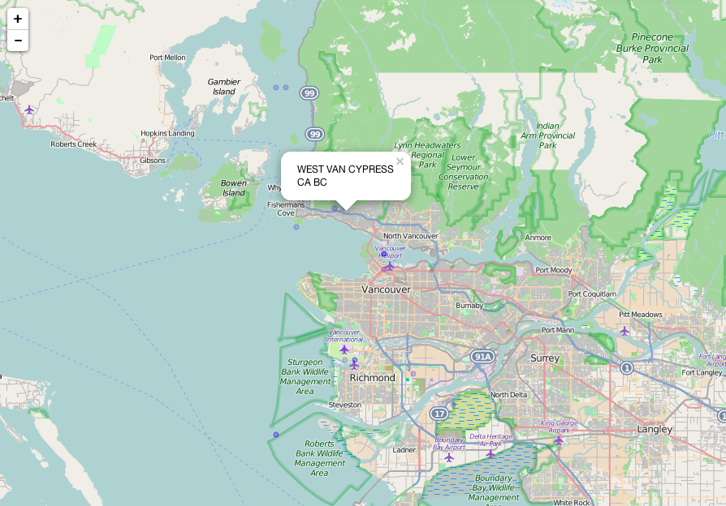

[](https://travis-ci.org/rich-iannone/stationaRy) 
[](http://issuestats.com/github/rich-iannone/stationaRy) 
[](http://issuestats.com/github/rich-iannone/stationaRy) 
 
[](https://codecov.io/github/rich-iannone/stationaRy?branch=master) 

Get hourly meteorological data from a station located somewhere on Earth.

## Examples

Get data from a station in Norway (with a **USAF** value of 13860, and a **WBAN** value of 99999). Specify the `station_id` as a string in the format `[USAF]-[WBAN]`, and, provide beginning and ending years for data collection to `startyear` and `endyear`, respectively.

```R
library(stationaRy)

met_data <- get_isd_station_data(station_id = "13860-99999",
                                 startyear = 2009,
                                 endyear = 2010)
```

That's great if you know the `USAF` and `WBAN` numbers for a particular met station. Most of the time, however, you won't have this info. You can search for station metadata using the `get_isd_stations` function. Without providing any arguments, it gives you a data frame containing the entire dataset of stations. Currently, there are 27,446 rows in the dataset. Here are rows 250-255 from the dataset:

```R
library(stationaRy)

get_isd_stations()[250:255,]
```

```
Source: local data frame [6 x 16]

   usaf  wban                 name country state    lat   lon elev begin  end
1 13220 99999          FORDE-TEFRE      NO       61.467 5.917   64  1973 2015
2 13230 99999           BRINGELAND      NO       61.393 5.764  327  1984 2015
3 13250 99999           MODALEN II      NO       60.833 5.950  114  1973 2008
4 13260 99999          MODALEN III      NO       60.850 5.983  125  2008 2015
5 13270 99999 KVAMSKOGEN-JONSHOGDI      NO       60.383 5.967  455  2006 2015
6 13280 99999           KVAMSKOGEN      NO       60.400 5.917  408  1973 2006
Variables not shown: gmt_offset (dbl), time_zone_id (chr), country_name (chr),
  country_code (chr), iso3166_2_subd (chr), fips10_4_subd (chr)
```

This list can be greatly reduced to isolate the stations of interest. One way to do this is to specify a geographic bounding box using lat/lon values to specify the bounds. Let's try a bounding box located in the west coast of Canada. 

```R
library(stationaRy)

get_isd_stations(lower_lat = 49.000,
                 upper_lat = 49.500,
                 lower_lon = -123.500,
                 upper_lon = -123.000)
```

```
Source: local data frame [20 x 16]

     usaf  wban                      name country state    lat      lon   elev begin  end
1  710040 99999    CYPRESS BOWL FREESTYLE      CA       49.400 -123.200  969.0  2007 2010
2  710370 99999            POINT ATKINSON      CA       49.330 -123.265   35.0  2003 2015
3  710420 99999           DELTA BURNS BOG      CA       49.133 -123.000    3.0  2001 2015
4  711120 99999 RICHMOND OPERATION CENTRE      CA       49.167 -123.067   16.0  1980 2015
5  712010 99999  VANCOUVER HARBOUR CS  BC      CA       49.283 -123.117    3.0  1980 2015
6  712013 99999            VANCOUVER INTL      CA       49.183 -123.167    3.0  1988 1988
7  712025 99999          WEST VAN CYPRESS      CA       49.350 -123.183  161.0  1993 1995
8  712045 99999           SAND HEADS (LS)      CA       49.100 -123.300    1.0  1992 1995
9  712090 99999          SANDHEADS CS  BC      CA       49.100 -123.300     NA  2001 2015
10 712110 99999      HOWE SOUND - PAM ROC      CA       49.483 -123.300    5.0  1996 2015
11 715620 99999    CYPRESS BOWL SNOWBOARD      CA       49.383 -123.200 1180.0  2010 2010
12 716080 99999  VANCOUVER SEA ISLAND CCG      CA       49.183 -123.183    2.1  1982 2015
13 716930 99999        CYPRESS BOWL SOUTH      CA       49.383 -123.200  886.0  2007 2014
14 717840 99999      WEST VANCOUVER (AUT)      CA       49.350 -123.200  168.0  1995 2015
15 718903 99999                 PAM ROCKS      CA       49.483 -123.283    0.0  1987 1995
16 718920 99999            VANCOUVER INTL      CA       49.194 -123.184    4.3  1955 2015
17 718925 99999         VANCOUVER HARBOUR      CA       49.300 -123.117    5.0  1977 1980
18 718926 99999       VANCOUVER HARBOUR &      CA       49.300 -123.117    5.0  1979 1979
19 728920 99999            VANCOUVER INTL      CA       49.183 -123.167    3.0  1973 1977
20 728925 99999       VANCOUVER HARBOUR &      CA       49.300 -123.117    5.0  1976 1977
Variables not shown: gmt_offset (dbl), time_zone_id (chr), country_name (chr),
  country_code (chr), iso3166_2_subd (chr), fips10_4_subd (chr)
```

To put these stations on a viewable map, use a `magrittr` or `pipeR` pipe, to send the output data frame as input to the `map_isd_stations` function. Pipes are great, amirite?

```R
library(stationaRy)
library(magrittr)

get_isd_stations(lower_lat = 49.000,
                 upper_lat = 49.500,
                 lower_lon = -123.500,
                 upper_lon = -123.000) %>%
  map_isd_stations()
```



Upon inspecting the data frame, you can reduce it to a single station by specifying it's name (or part of its name). In this example, we wish to get data from the `CYPRESS BOWL SNOWBOARD` station. This can be done by extending with `select_isd_station` and using the `name` argument to supply part of the station name.

```R
library(stationaRy)
library(magrittr)

get_isd_stations(lower_lat = 49.000,
                 upper_lat = 49.500,
                 lower_lon = -123.500,
                 upper_lon = -123.000) %>%
  select_isd_station(name = "cypress bowl")
```

```
Several stations matched. Provide a more specific search term.
Source: local data frame [3 x 16]

    usaf  wban                   name country state    lat    lon elev begin  end
1 710040 99999 CYPRESS BOWL FREESTYLE      CA       49.400 -123.2  969  2007 2010
2 715620 99999 CYPRESS BOWL SNOWBOARD      CA       49.383 -123.2 1180  2010 2010
3 716930 99999     CYPRESS BOWL SOUTH      CA       49.383 -123.2  886  2007 2014
Variables not shown: gmt_offset (dbl), time_zone_id (chr), country_name (chr),
  country_code (chr), iso3166_2_subd (chr), fips10_4_subd (chr)
[1] NA
```

As this function yielded a data frame with 3 stations (3 stations leading with `CYPRESS BOWL` in their station names), a set of strategies will be used to obtain single station. There are two ways to get a year of `CYPRESS BOWL SNOWBOARD` data for `2010`: (1) provide the full name of the station, or (2) use the data frame with multiple stations and specify the row of the target station.

```R
library(stationaRy)
library(magrittr)

cypress_bowl_snowboard_1 <- 
  get_isd_stations(lower_lat = 49.000,
                   upper_lat = 49.500,
                   lower_lon = -123.500,
                   upper_lon = -123.000) %>%
    select_isd_station(name = "cypress bowl snowboard") %>%
    get_isd_station_data(startyear = 2010, endyear = 2010)
    
cypress_bowl_snowboard_2 <- 
  get_isd_stations(lower_lat = 49.000,
                   upper_lat = 49.500,
                   lower_lon = -123.500,
                   upper_lon = -123.000) %>%
    select_isd_station(name = "cypress bowl", number = 2) %>%
    get_isd_station_data(startyear = 2010, endyear = 2010)
```

Both statements get the same met data (the `select_isd_station` function simply passes a `USAF`/`WBAN` string to `get_isd_station_data` via the `%>%` operator). Here's a bit of that met data:

```
Source: local data frame [711 x 18]

     usaf  wban year month day hour minute    lat      lon elev wd ws ceil_hgt temp
1  715620 99999 2010     1  28   16      0 50.633 -128.117  568 NA NA       NA  1.3
2  715620 99999 2010     1  28   22      0 50.633 -128.117  568 NA NA       NA  2.5
3  715620 99999 2010     1  29    4      0 50.633 -128.117  568 NA NA       NA  3.1
4  715620 99999 2010     1  29   10      0 50.633 -128.117  568 NA NA       NA  5.5
5  715620 99999 2010     1  29   16      0 50.633 -128.117  568 NA NA       NA  3.0
6  715620 99999 2010     1  29   22      0 50.633 -128.117  568 NA NA       NA  1.5
7  715620 99999 2010     1  30    4      0 50.633 -128.117  568 NA NA       NA  0.3
8  715620 99999 2010     1  30   10      0 50.633 -128.117  568 NA NA       NA  0.9
9  715620 99999 2010     1  30   16      0 50.633 -128.117  568 NA NA       NA  0.7
10 715620 99999 2010     1  30   22      0 50.633 -128.117  568 NA NA       NA -0.1
..    ...   ...  ...   ... ...  ...    ...    ...      ...  ... .. ..      ...  ...
Variables not shown: dew_point (dbl), atmos_pres (dbl), rh (dbl), time (time)
```

If you'd like to get weather data from a weather station at Tofino, BC, CA, it's possible to search using `tofino` as the value for the `name` argument in the `select_isd_stations` function.

```R
library(stationaRy)
library(magrittr)

get_isd_stations() %>%
  select_isd_station(name = "tofino")
```

```
Several stations matched. Provide a more specific search term.
Source: local data frame [4 x 16]

    usaf  wban           name country state    lat      lon elev begin  end
1 711060 94234 TOFINO AIRPORT      CA    BC 49.083 -125.767 24.0  1958 2015
2 711060 99999         TOFINO      CA       49.082 -125.773 24.4  2000 2004
3 741060 94234         TOFINO      CA       49.083 -125.767 20.0  1973 1977
4 999999 94234         TOFINO      CA       49.083 -125.767 24.1  1964 1972
Variables not shown: gmt_offset (dbl), time_zone_id (chr), country_name (chr),
  country_code (chr), iso3166_2_subd (chr), fips10_4_subd (chr)
[1] NA
```

A number of stations with `tofino` in its name were returned. If the first station in the returned data frame is desired, it can be selected with a slight modification to the `select_isd_station` call (using the `number` argument). Then, pipe the output to the `get_isd_station_data` function and supply the desired period of retrieval.

```R
library(stationaRy)
library(magrittr)

tofino_airport_2005_2010 <- 
  get_isd_stations() %>%
    select_isd_station(name = "tofino", number = 1) %>%
    get_isd_station_data(startyear = 2005, endyear = 2010)
```

That's gives you 34,877 rows of meteorological data from the Tofino Airport station:

```
Source: local data frame [34,877 x 18]

     usaf  wban year month day hour minute    lat      lon elev wd  ws ceil_hgt
1  711060 94234 2005     1   1    7      0 49.083 -125.767   24 NA 0.0     1500
2  711060 94234 2005     1   1    8      0 49.083 -125.767   24 NA 0.0     1500
3  711060 94234 2005     1   1    9      0 49.083 -125.767   24 NA 0.0     1500
4  711060 94234 2005     1   1   10      0 49.083 -125.767   24 NA 0.0     1200
5  711060 94234 2005     1   1   11      0 49.083 -125.767   24 80 1.5     1200
6  711060 94234 2005     1   1   12      0 49.083 -125.767   24 NA 0.0     1650
7  711060 94234 2005     1   1   13      0 49.083 -125.767   24 40 2.6     1650
8  711060 94234 2005     1   1   14      0 49.083 -125.767   24 50 3.6     1650
9  711060 94234 2005     1   1   15      0 49.083 -125.767   24 70 1.0      900
10 711060 94234 2005     1   1   16      0 49.083 -125.767   24 60 1.5     1650
..    ...   ...  ...   ... ...  ...    ...    ...      ...  ... .. ...      ...
Variables not shown: temp (dbl), dew_point (dbl), atmos_pres (dbl), rh (dbl), time
  (time)
```

Of course, **dplyr** works really well to work toward the data you need. Suppose you'd like to collect several years of met data from a particular station and get only a listing of parameters that meet some criterion. Here's an example of obtaining temperatures above 37 degrees Celsius from a particular station:

```R
library(stationaRy)
library(magrittr)
library(dplyr)

high_temps_at_bergen_point_stn <- 
  get_isd_stations() %>%
  select_isd_station(name = "bergen point") %>%
  get_isd_station_data(startyear = 2006, endyear = 2015) %>%
  select(time, wd, ws, temp) %>% 
  filter(temp > 37) %>%
  mutate(temp_f = (temp * (9/5)) + 32)
```

```
#> Source: local data frame [3 x 5]
#> 
#>                  time  wd  ws temp temp_f
#> 1 2012-07-18 12:00:00 230 1.5 37.2  98.96
#> 2 2012-07-18 13:00:00 220 2.6 37.8 100.04
#> 3 2012-07-18 14:00:00 230 4.1 37.9 100.22
```

There can actually be a lot of additional met data beyond wind speed, temperatures, etc. It can vary greatly depending on the selected station. These additional categories are denoted 'two-letter + digit' identifiers (e.g., `AA1`, `GA1`, etc.). Here are the different parameters:

Category | Column Name
---|---
`AA1` | `aa1_liq_precip_period_quantity`
`AA1` | `aa1_liq_precip_depth_dimension`
`AA1` | `aa1_liq_precip_condition_code`
`AB1` | `aa1_liq_precip_quality_code`
`AB1` | `ab1_liq_precip_monthly_depth_dimension`
`AB1` | `ab1_liq_precip_monthly_condition_code`
`AB1` | `ab1_liq_precip_monthly_quality_code`
`AC1` | `ac1_precip_obs_history_duration_code`
`AC1` | `ac1_precip_obs_history_characteristic_code`
`AC1` | `ac1_precip_obs_history_quality_code`
`AD1` | `ad1_liq_precip_greatest_amt_24h_month_depth_dimension`
`AD1` | `ad1_liq_precip_greatest_amt_24h_month_condition_code`
`AD1` | `ad1_liq_precip_greatest_amt_24h_month_dates`
`AD1` | `ad1_liq_precip_greatest_amt_24h_month_quality_code`
`AE1` | `ae1_liq_precip_number_days_amt_month__01inch`
`AE1` | `ae1_liq_precip_number_days_amt_month__01inch_quality_code`
`AE1` | `ae1_liq_precip_number_days_amt_month__10inch`
`AE1` | `ae1_liq_precip_number_days_amt_month__10inch_quality_code`
`AE1` | `ae1_liq_precip_number_days_amt_month__50inch`
`AE1` | `ae1_liq_precip_number_days_amt_month__50inch_quality_code`
`AE1` | `ae1_liq_precip_number_days_amt_month_1_00inch`
`AE1` | `ae1_liq_precip_number_days_amt_month_1_00inch_quality_code`
`AG1` | `ag1_precip_est_obs_discrepancy_code`
`AG1` | `ag1_precip_est_obs_est_water_depth_dimension`
`AH1` | `ah1_liq_precip_max_short_dur_month_period_quantity`
`AH1` | `ah1_liq_precip_max_short_dur_month_depth_dimension`
`AH1` | `ah1_liq_precip_max_short_dur_month_condition_code`
`AH1` | `ah1_liq_precip_max_short_dur_month_end_date_time`
`AH1` | `ah1_liq_precip_max_short_dur_month_quality_code`
`AI1` | `ai1_liq_precip_max_short_dur_month_period_quantity`
`AI1` | `ai1_liq_precip_max_short_dur_month_depth_dimension`
`AI1` | `ai1_liq_precip_max_short_dur_month_condition_code`
`AI1` | `ai1_liq_precip_max_short_dur_month_end_date_time`
`AI1` | `ai1_liq_precip_max_short_dur_month_quality_code`
`AJ1` | `aj1_snow_depth_dimension`
`AJ1` | `aj1_snow_depth_condition_code`
`AJ1` | `aj1_snow_depth_quality_code`
`AJ1` | `aj1_snow_depth_equiv_water_depth_dimension`
`AJ1` | `aj1_snow_depth_equiv_water_condition_code`
`AJ1` | `aj1_snow_depth_equiv_water_quality_code`
`AK1` | `ak1_snow_depth_greatest_depth_month_depth_dimension`
`AK1` | `ak1_snow_depth_greatest_depth_month_condition_code`
`AK1` | `ak1_snow_depth_greatest_depth_month_dates_occurrence`
`AK1` | `ak1_snow_depth_greatest_depth_month_quality_code`
`AL1` | `al1_snow_accumulation_period_quantity`
`AL1` | `al1_snow_accumulation_depth_dimension`
`AL1` | `al1_snow_accumulation_condition_code`
`AL1` | `al1_snow_accumulation_quality_code`
`AM1` | `am1_snow_accumulation_greatest_amt_24h_month_depth_dimension`
`AM1` | `am1_snow_accumulation_greatest_amt_24h_month_condition_code`
`AM1` | `am1_snow_accumulation_greatest_amt_24h_month_dates_occurrence_1`
`AM1` | `am1_snow_accumulation_greatest_amt_24h_month_dates_occurrence_2`
`AM1` | `am1_snow_accumulation_greatest_amt_24h_month_dates_occurrence_3`
`AM1` | `am1_snow_accumulation_greatest_amt_24h_month_quality_code`
`AN1` | `an1_snow_accumulation_month_period_quantity`
`AN1` | `an1_snow_accumulation_month_depth_dimension`
`AN1` | `an1_snow_accumulation_month_condition_code`
`AN1` | `an1_snow_accumulation_month_quality_code`
`AO1` | `ao1_liq_precip_period_quantity_minutes`
`AO1` | `ao1_liq_precip_depth_dimension`
`AO1` | `ao1_liq_precip_condition_code`
`AO1` | `ao1_liq_precip_quality_code`
`AP1` | `ap1_15_min_liq_precip_hpd_gauge_value_45_min_prior`
`AP1` | `ap1_15_min_liq_precip_hpd_gauge_value_30_min_prior`
`AP1` | `ap1_15_min_liq_precip_hpd_gauge_value_15_min_prior`
`AP1` | `ap1_15_min_liq_precip_hpd_gauge_value_at_obs_time`
`AU1` | `au1_present_weather_obs_intensity_code`
`AU1` | `au1_present_weather_obs_descriptor_code`
`AU1` | `au1_present_weather_obs_precipitation_code`
`AU1` | `au1_present_weather_obs_obscuration_code`
`AU1` | `au1_present_weather_obs_other_weather_phenomena_code`
`AU1` | `au1_present_weather_obs_combination_indicator_code`
`AU1` | `au1_present_weather_obs_quality_code`
`AW1` | `aw1_present_weather_obs_aut_weather_report_1`
`AW1` | `aw1_present_weather_obs_aut_weather_report_2`
`AW1` | `aw1_present_weather_obs_aut_weather_report_3`
`AW1` | `aw1_present_weather_obs_aut_weather_report_4`
`AX1` | `ax1_past_weather_obs_atmos_condition_code`
`AX1` | `ax1_past_weather_obs_quality_manual_atmos_condition_code`
`AX1` | `ax1_past_weather_obs_period_quantity`
`AX1` | `ax1_past_weather_obs_period_quality_code`
`AY1` | `ay1_past_weather_obs_manual_occurrence_identifier`
`AY1` | `ay1_past_weather_obs_quality_manual_atmos_condition_code`
`AY1` | `ay1_past_weather_obs_period_quantity`
`AY1` | `ay1_past_weather_obs_period_quality_code`
`AZ1` | `az1_past_weather_obs_aut_occurrence_identifier`
`AZ1` | `az1_past_weather_obs_quality_aut_atmos_condition_code`
`AZ1` | `az1_past_weather_obs_period_quantity`
`AZ1` | `az1_past_weather_obs_period_quality_code`
`CB1` | `cb1_subhrly_obs_liq_precip_2_sensor_period_quantity`
`CB1` | `cb1_subhrly_obs_liq_precip_2_sensor_precip_liq_depth`
`CB1` | `cb1_subhrly_obs_liq_precip_2_sensor_qc_quality_code`
`CB1` | `cb1_subhrly_obs_liq_precip_2_sensor_flag_quality_code`
`CF1` | `cf1_hrly_fan_speed_rate`
`CF1` | `cf1_hrly_fan_qc_quality_code`
`CF1` | `cf1_hrly_fan_flag_quality_code`
`CG1` | `cg1_subhrly_obs_liq_precip_1_sensor_precip_liq_depth`
`CG1` | `cg1_subhrly_obs_liq_precip_1_sensor_qc_quality_code`
`CG1` | `cg1_subhrly_obs_liq_precip_1_sensor_flag_quality_code`
`CH1` | `ch1_hrly_subhrly_rh_temp_period_quantity`
`CH1` | `ch1_hrly_subhrly_temp_avg_air_temp`
`CH1` | `ch1_hrly_subhrly_temp_qc_quality_code`
`CH1` | `ch1_hrly_subhrly_temp_flag_quality_code`
`CH1` | `ch1_hrly_subhrly_rh_avg_rh`
`CH1` | `ch1_hrly_subhrly_rh_qc_quality_code`
`CH1` | `ch1_hrly_subhrly_rh_flag_quality_code`
`CI1` | `ci1_hrly_rh_temp_min_hrly_temp`
`CI1` | `ci1_hrly_rh_temp_min_hrly_temp_qc_quality_code`
`CI1` | `ci1_hrly_rh_temp_min_hrly_temp_flag_quality_code`
`CI1` | `ci1_hrly_rh_temp_max_hrly_temp`
`CI1` | `ci1_hrly_rh_temp_max_hrly_temp_qc_quality_code`
`CI1` | `ci1_hrly_rh_temp_max_hrly_temp_flag_quality_code`
`CI1` | `ci1_hrly_rh_temp_std_dev_hrly_temp`
`CI1` | `ci1_hrly_rh_temp_std_dev_hrly_temp_qc_quality_code`
`CI1` | `ci1_hrly_rh_temp_std_dev_hrly_temp_flag_quality_code`
`CI1` | `ci1_hrly_rh_temp_std_dev_hrly_rh`
`CI1` | `ci1_hrly_rh_temp_std_dev_hrly_rh_qc_quality_code`
`CI1` | `ci1_hrly_rh_temp_std_dev_hrly_rh_flag_quality_code`
`CN1` | `cn1_hrly_batvol_sensors_transm_avg_voltage`
`CN1` | `cn1_hrly_batvol_sensors_transm_avg_voltage_qc_quality_code`
`CN1` | `cn1_hrly_batvol_sensors_transm_avg_voltage_flag_quality_code`
`CN1` | `cn1_hrly_batvol_full_load_avg_voltage`
`CN1` | `cn1_hrly_batvol_full_load_avg_voltage_qc_quality_code`
`CN1` | `cn1_hrly_batvol_full_load_avg_voltage_flag_quality_code`
`CN1` | `cn1_hrly_batvol_datalogger_avg_voltage`
`CN1` | `cn1_hrly_batvol_datalogger_avg_voltage_qc_quality_code`
`CN1` | `cn1_hrly_batvol_datalogger_avg_voltage_flag_quality_code`
`CN2` | `cn2_hrly_diagnostic_equipment_temp`
`CN2` | `cn2_hrly_diagnostic_equipment_temp_qc_quality_code`
`CN2` | `cn2_hrly_diagnostic_equipment_temp_flag_quality_code`
`CN2` | `cn2_hrly_diagnostic_geonor_inlet_temp`
`CN2` | `cn2_hrly_diagnostic_geonor_inlet_temp_qc_quality_code`
`CN2` | `cn2_hrly_diagnostic_geonor_inlet_temp_flag_quality_code`
`CN2` | `cn2_hrly_diagnostic_datalogger_opendoor_time`
`CN2` | `cn2_hrly_diagnostic_datalogger_opendoor_time_qc_quality_code`
`CN2` | `cn2_hrly_diagnostic_datalogger_opendoor_time_flag_quality_code`
`CN3` | `cn3_hrly_diagnostic_reference_resistor_avg_resistance`
`CN3` | `cn3_hrly_diagnostic_reference_resistor_avg_resistance_qc_quality_code`
`CN3` | `cn3_hrly_diagnostic_reference_resistor_avg_resistance_flag_quality_code`
`CN3` | `cn3_hrly_diagnostic_datalogger_signature_id`
`CN3` | `cn3_hrly_diagnostic_datalogger_signature_id_qc_quality_code`
`CN3` | `cn3_hrly_diagnostic_datalogger_signature_id_flag_quality_code`
`CN4` | `cn4_hrly_diagnostic_liq_precip_gauge_flag_bit`
`CN4` | `cn4_hrly_diagnostic_liq_precip_gauge_flag_bit_qc_quality_code`
`CN4` | `cn4_hrly_diagnostic_liq_precip_gauge_flag_bit_flag_quality_code`
`CN4` | `cn4_hrly_diagnostic_doorflag_field`
`CN4` | `cn4_hrly_diagnostic_doorflag_field_qc_quality_code`
`CN4` | `cn4_hrly_diagnostic_doorflag_field_flag_quality_code`
`CN4` | `cn4_hrly_diagnostic_forward_transmitter_rf_power`
`CN4` | `cn4_hrly_diagnostic_forward_transmitter_rf_power_qc_quality_code`
`CN4` | `cn4_hrly_diagnostic_forward_transmitter_rf_power_flag_quality_code`
`CN4` | `cn4_hrly_diagnostic_reflected_transmitter_rf_power`
`CN4` | `cn4_hrly_diagnostic_reflected_transmitter_rf_power_qc_quality_code`
`CN4` | `cn4_hrly_diagnostic_reflected_transmitter_rf_power_flag_quality_code`
`CR1` | `cr1_control_section_datalogger_version_number`
`CR1` | `cr1_control_section_datalogger_version_number_qc_quality_code`
`CR1` | `cr1_control_section_datalogger_version_number_flag_quality_code`
`CT1` | `ct1_subhrly_temp_avg_air_temp`
`CT1` | `ct1_subhrly_temp_avg_air_temp_qc_quality_code`
`CT1` | `ct1_subhrly_temp_avg_air_temp_flag_quality_code`
`CU1` | `cu1_hrly_temp_avg_air_temp`
`CU1` | `cu1_hrly_temp_avg_air_temp_qc_quality_code`
`CU1` | `cu1_hrly_temp_avg_air_temp_flag_quality_code`
`CU1` | `cu1_hrly_temp_avg_air_temp_st_dev`
`CU1` | `cu1_hrly_temp_avg_air_temp_st_dev_qc_quality_code`
`CU1` | `cu1_hrly_temp_avg_air_temp_st_dev_flag_quality_code`
`CV1` | `cv1_hrly_temp_min_air_temp`
`CV1` | `cv1_hrly_temp_min_air_temp_qc_quality_code`
`CV1` | `cv1_hrly_temp_min_air_temp_flag_quality_code`
`CV1` | `cv1_hrly_temp_min_air_temp_time`
`CV1` | `cv1_hrly_temp_min_air_temp_time_qc_quality_code`
`CV1` | `cv1_hrly_temp_min_air_temp_time_flag_quality_code`
`CV1` | `cv1_hrly_temp_max_air_temp`
`CV1` | `cv1_hrly_temp_max_air_temp_qc_quality_code`
`CV1` | `cv1_hrly_temp_max_air_temp_flag_quality_code`
`CV1` | `cv1_hrly_temp_max_air_temp_time`
`CV1` | `cv1_hrly_temp_max_air_temp_time_qc_quality_code`
`CV1` | `cv1_hrly_temp_max_air_temp_time_flag_quality_code`
`CW1` | `cw1_subhrly_wetness_wet1_indicator`
`CW1` | `cw1_subhrly_wetness_wet1_indicator_qc_quality_code`
`CW1` | `cw1_subhrly_wetness_wet1_indicator_flag_quality_code`
`CW1` | `cw1_subhrly_wetness_wet2_indicator`
`CW1` | `cw1_subhrly_wetness_wet2_indicator_qc_quality_code`
`CW1` | `cw1_subhrly_wetness_wet2_indicator_flag_quality_code`
`CX1` | `cx1_hourly_geonor_vib_wire_total_precip`
`CX1` | `cx1_hourly_geonor_vib_wire_total_precip_qc_quality_code`
`CX1` | `cx1_hourly_geonor_vib_wire_total_precip_flag_quality_code`
`CX1` | `cx1_hourly_geonor_vib_wire_freq_avg_precip`
`CX1` | `cx1_hourly_geonor_vib_wire_freq_avg_precip_qc_quality_code`
`CX1` | `cx1_hourly_geonor_vib_wire_freq_avg_precip_flag_quality_code`
`CX1` | `cx1_hourly_geonor_vib_wire_freq_min_precip`
`CX1` | `cx1_hourly_geonor_vib_wire_freq_min_precip_qc_quality_code`
`CX1` | `cx1_hourly_geonor_vib_wire_freq_min_precip_flag_quality_code`
`CX1` | `cx1_hourly_geonor_vib_wire_freq_max_precip`
`CX1` | `cx1_hourly_geonor_vib_wire_freq_max_precip_qc_quality_code`
`CX1` | `cx1_hourly_geonor_vib_wire_freq_max_precip_flag_quality_code`
`CO1` | `co1_network_metadata_climate_division_number`
`CO1` | `co1_network_metadata_utc_lst_time_conversion`
`CO1` | `co2_us_network_cooperative_element_id`
`CO1` | `co2_us_network_cooperative_time_offset`
`ED1` | `ed1_runway_vis_range_obs_direction_angle`
`ED1` | `ed1_runway_vis_range_obs_runway_designator_code`
`ED1` | `ed1_runway_vis_range_obs_vis_dimension`
`ED1` | `ed1_runway_vis_range_obs_quality_code`
`GA1` | `ga1_sky_cover_layer_coverage_code`
`GA1` | `ga1_sky_cover_layer_coverage_quality_code`
`GA1` | `ga1_sky_cover_layer_base_height`
`GA1` | `ga1_sky_cover_layer_base_height_quality_code`
`GA1` | `ga1_sky_cover_layer_cloud_type`
`GA1` | `ga1_sky_cover_layer_cloud_type_quality_code`
`GD1` | `gd1_sky_cover_summation_state_coverage_1`
`GD1` | `gd1_sky_cover_summation_state_coverage_2`
`GD1` | `gd1_sky_cover_summation_state_coverage_quality_code`
`GD1` | `gd1_sky_cover_summation_state_height`
`GD1` | `gd1_sky_cover_summation_state_height_quality_code`
`GD1` | `gd1_sky_cover_summation_state_characteristic_code`
`GF1` | `gf1_sky_condition_obs_total_coverage`
`GF1` | `gf1_sky_condition_obs_total_opaque_coverage`
`GF1` | `gf1_sky_condition_obs_total_coverage_quality_code`
`GF1` | `gf1_sky_condition_obs_total_lowest_cloud_cover`
`GF1` | `gf1_sky_condition_obs_total_lowest_cloud_cover_quality_code`
`GF1` | `gf1_sky_condition_obs_low_cloud_genus`
`GF1` | `gf1_sky_condition_obs_low_cloud_genus_quality_code`
`GF1` | `gf1_sky_condition_obs_lowest_cloud_base_height`
`GF1` | `gf1_sky_condition_obs_lowest_cloud_base_height_quality_code`
`GF1` | `gf1_sky_condition_obs_mid_cloud_genus`
`GF1` | `gf1_sky_condition_obs_mid_cloud_genus_quality_code`
`GF1` | `gf1_sky_condition_obs_high_cloud_genus`
`GF1` | `gf1_sky_condition_obs_high_cloud_genus_quality_code`
`GG1` | `gg1_below_stn_cloud_layer_coverage`
`GG1` | `gg1_below_stn_cloud_layer_coverage_quality_code`
`GG1` | `gg1_below_stn_cloud_layer_top_height`
`GG1` | `gg1_below_stn_cloud_layer_top_height_quality_code`
`GG1` | `gg1_below_stn_cloud_layer_type`
`GG1` | `gg1_below_stn_cloud_layer_type_quality_code`
`GG1` | `gg1_below_stn_cloud_layer_top`
`GG1` | `gg1_below_stn_cloud_layer_top_quality_code`
`GH1` | `gh1_hrly_solar_rad_hrly_avg_solarad`
`GH1` | `gh1_hrly_solar_rad_hrly_avg_solarad_qc_quality_code`
`GH1` | `gh1_hrly_solar_rad_hrly_avg_solarad_flag_quality_code`
`GH1` | `gh1_hrly_solar_rad_min_solarad`
`GH1` | `gh1_hrly_solar_rad_min_solarad_qc_quality_code`
`GH1` | `gh1_hrly_solar_rad_min_solarad_flag_quality_code`
`GH1` | `gh1_hrly_solar_rad_max_solarad`
`GH1` | `gh1_hrly_solar_rad_max_solarad_qc_quality_code`
`GH1` | `gh1_hrly_solar_rad_max_solarad_flag_quality_code`
`GH1` | `gh1_hrly_solar_rad_std_dev_solarad`
`GH1` | `gh1_hrly_solar_rad_std_dev_solarad_qc_quality_code`
`GH1` | `gh1_hrly_solar_rad_std_dev_solarad_flag_quality_code`
`GJ1` | `gj1_sunshine_obs_duration`
`GJ1` | `gj1_sunshine_obs_duration_quality_code`
`GK1` | `gk1_sunshine_obs_pct_possible_sunshine`
`GK1` | `gk1_sunshine_obs_pct_possible_quality_code`
`GL1` | `gl1_sunshine_obs_duration`
`GL1` | `gl1_sunshine_obs_duration_quality_code`
`GM1` | `gm1_solar_irradiance_time_period`
`GM1` | `gm1_solar_irradiance_global_irradiance`
`GM1` | `gm1_solar_irradiance_global_irradiance_data_flag`
`GM1` | `gm1_solar_irradiance_global_irradiance_quality_code`
`GM1` | `gm1_solar_irradiance_direct_beam_irradiance`
`GM1` | `gm1_solar_irradiance_direct_beam_irradiance_data_flag`
`GM1` | `gm1_solar_irradiance_direct_beam_irradiance_quality_code`
`GM1` | `gm1_solar_irradiance_diffuse_irradiance`
`GM1` | `gm1_solar_irradiance_diffuse_irradiance_data_flag`
`GM1` | `gm1_solar_irradiance_diffuse_irradiance_quality_code`
`GM1` | `gm1_solar_irradiance_uvb_global_irradiance`
`GM1` | `gm1_solar_irradiance_uvb_global_irradiance_data_flag`
`GM1` | `gm1_solar_irradiance_uvb_global_irradiance_quality_code`
`GN1` | `gn1_solar_rad_time_period`
`GN1` | `gn1_solar_rad_upwelling_global_solar_rad`
`GN1` | `gn1_solar_rad_upwelling_global_solar_rad_quality_code`
`GN1` | `gn1_solar_rad_downwelling_thermal_ir_rad`
`GN1` | `gn1_solar_rad_downwelling_thermal_ir_rad_quality_code`
`GN1` | `gn1_solar_rad_upwelling_thermal_ir_rad`
`GN1` | `gn1_solar_rad_upwelling_thermal_ir_rad_quality_code`
`GN1` | `gn1_solar_rad_par`
`GN1` | `gn1_solar_rad_par_quality_code`
`GN1` | `gn1_solar_rad_solar_zenith_angle`
`GN1` | `gn1_solar_rad_solar_zenith_angle_quality_code`
`GO1` | `go1_net_solar_rad_time_period`
`GO1` | `go1_net_solar_rad_net_solar_radiation`
`GO1` | `go1_net_solar_rad_net_solar_radiation_quality_code`
`GO1` | `go1_net_solar_rad_net_ir_radiation`
`GO1` | `go1_net_solar_rad_net_ir_radiation_quality_code`
`GO1` | `go1_net_solar_rad_net_radiation`
`GO1` | `go1_net_solar_rad_net_radiation_quality_code`
`GP1` | `gp1_modeled_solar_irradiance_data_time_period`
`GP1` | `gp1_modeled_solar_irradiance_global_horizontal`
`GP1` | `gp1_modeled_solar_irradiance_global_horizontal_src_flag`
`GP1` | `gp1_modeled_solar_irradiance_global_horizontal_uncertainty`
`GP1` | `gp1_modeled_solar_irradiance_direct_normal`
`GP1` | `gp1_modeled_solar_irradiance_direct_normal_src_flag`
`GP1` | `gp1_modeled_solar_irradiance_direct_normal_uncertainty`
`GP1` | `gp1_modeled_solar_irradiance_diffuse_normal`
`GP1` | `gp1_modeled_solar_irradiance_diffuse_normal_src_flag`
`GP1` | `gp1_modeled_solar_irradiance_diffuse_normal_uncertainty`
`GP1` | `gp1_modeled_solar_irradiance_diffuse_horizontal`
`GP1` | `gp1_modeled_solar_irradiance_diffuse_horizontal_src_flag`
`GP1` | `gp1_modeled_solar_irradiance_diffuse_horizontal_uncertainty`
`GQ1` | `gq1_hrly_solar_angle_time_period`
`GQ1` | `gq1_hrly_solar_angle_mean_zenith_angle`
`GQ1` | `gq1_hrly_solar_angle_mean_zenith_angle_quality_code`
`GQ1` | `gq1_hrly_solar_angle_mean_azimuth_angle`
`GQ1` | `gq1_hrly_solar_angle_mean_azimuth_angle_quality_code`
`GR1` | `gr1_hrly_extraterrestrial_rad_time_period`
`GR1` | `gr1_hrly_extraterrestrial_rad_horizontal`
`GR1` | `gr1_hrly_extraterrestrial_rad_horizontal_quality_code`
`GR1` | `gr1_hrly_extraterrestrial_rad_normal`
`GR1` | `gr1_hrly_extraterrestrial_rad_normal_quality_code`
`HL1` | `hl1_hail_size`
`HL1` | `hl1_hail_size_quality_code`
`IA1` | `ia1_ground_surface_obs_code`
`IA1` | `ia1_ground_surface_obs_code_quality_code`
`IA2` | `ia2_ground_surface_obs_min_temp_time_period`
`IA2` | `ia2_ground_surface_obs_min_temp`
`IA2` | `ia2_ground_surface_obs_min_temp_quality_code`
`IB1` | `ib1_hrly_surface_temp`
`IB1` | `ib1_hrly_surface_temp_qc_quality_code`
`IB1` | `ib1_hrly_surface_temp_flag_quality_code`
`IB1` | `ib1_hrly_surface_min_temp`
`IB1` | `ib1_hrly_surface_min_temp_qc_quality_code`
`IB1` | `ib1_hrly_surface_min_temp_flag_quality_code`
`IB1` | `ib1_hrly_surface_max_temp`
`IB1` | `ib1_hrly_surface_max_temp_qc_quality_code`
`IB1` | `ib1_hrly_surface_max_temp_flag_quality_code`
`IB1` | `ib1_hrly_surface_std_temp`
`IB1` | `ib1_hrly_surface_std_temp_qc_quality_code`
`IB1` | `ib1_hrly_surface_std_temp_flag_quality_code`
`IB2` | `ib2_hrly_surface_temp_sb`
`IB2` | `ib2_hrly_surface_temp_sb_qc_quality_code`
`IB2` | `ib2_hrly_surface_temp_sb_flag_quality_code`
`IB2` | `ib2_hrly_surface_temp_sb_std`
`IB2` | `ib2_hrly_surface_temp_sb_std_qc_quality_code`
`IB2` | `ib2_hrly_surface_temp_sb_std_flag_quality_code`
`IC1` | `ic1_grnd_surface_obs_pan_evap_time_period`
`IC1` | `ic1_grnd_surface_obs_pan_evap_wind`
`IC1` | `ic1_grnd_surface_obs_pan_evap_wind_condition_code`
`IC1` | `ic1_grnd_surface_obs_pan_evap_wind_quality_code`
`IC1` | `ic1_grnd_surface_obs_pan_evap_data`
`IC1` | `ic1_grnd_surface_obs_pan_evap_data_condition_code`
`IC1` | `ic1_grnd_surface_obs_pan_evap_data_quality_code`
`IC1` | `ic1_grnd_surface_obs_pan_max_water_data`
`IC1` | `ic1_grnd_surface_obs_pan_max_water_data_condition_code`
`IC1` | `ic1_grnd_surface_obs_pan_max_water_data_quality_code`
`IC1` | `ic1_grnd_surface_obs_pan_min_water_data`
`IC1` | `ic1_grnd_surface_obs_pan_min_water_data_condition_code`
`IC1` | `ic1_grnd_surface_obs_pan_min_water_data_quality_code`
`KA1` | `ka1_extreme_air_temp_time_period`
`KA1` | `ka1_extreme_air_temp_code`
`KA1` | `ka1_extreme_air_temp_high_or_low`
`KA1` | `ka1_extreme_air_temp_high_or_low_quality_code`
`KB1` | `kb1_avg_air_temp_time_period`
`KB1` | `kb1_avg_air_temp_code`
`KB1` | `kb1_avg_air_temp_air_temp`
`KB1` | `kb1_avg_air_temp_air_temp_quality_code`
`KC1` | `kc1_extreme_air_temp_monthly_code`
`KC1` | `kc1_extreme_air_temp_monthly_condition_code`
`KC1` | `kc1_extreme_air_temp_monthly_temp`
`KC1` | `kc1_extreme_air_temp_monthly_date`
`KC1` | `kc1_extreme_air_temp_monthly_temp_quality_code`
`KD1` | `kd1_heat_cool_deg_days_time_period`
`KD1` | `kd1_heat_cool_deg_days_code`
`KD1` | `kd1_heat_cool_deg_days_value`
`KD1` | `kd1_heat_cool_deg_days_quality_code`
`KE1` | `ke1_extreme_temp_number_days_max_32f_or_lower`
`KE1` | `ke1_extreme_temp_number_days_max_32f_or_lower_quality_code`
`KE1` | `ke1_extreme_temp_number_days_max_90f_or_higher`
`KE1` | `ke1_extreme_temp_number_days_max_90f_or_higher_quality_code`
`KE1` | `ke1_extreme_temp_number_days_min_32f_or_lower`
`KE1` | `ke1_extreme_temp_number_days_min_32f_or_lower_quality_code`
`KE1` | `ke1_extreme_temp_number_days_min_0f_or_lower`
`KE1` | `ke1_extreme_temp_number_days_min_0f_or_lower_quality_code`
`KF1` | `kf1_hrly_calc_temp`
`KF1` | `kf1_hrly_calc_temp_quality_code`
`KG1` | `kg1_avg_dp_wb_temp_time_period`
`KG1` | `kg1_avg_dp_wb_temp_code`
`KG1` | `kg1_avg_dp_wb_temp`
`KG1` | `kg1_avg_dp_wb_temp_derived_code`
`KG1` | `kg1_avg_dp_wb_temp_quality_code`
`MA1` | `ma1_atmos_p_obs_altimeter_setting_rate`
`MA1` | `ma1_atmos_p_obs_altimeter_quality_code`
`MA1` | `ma1_atmos_p_obs_stn_pressure_rate`
`MA1` | `ma1_atmos_p_obs_stn_pressure_rate_quality_code`
`MD1` | `md1_atmos_p_change_tendency_code`
`MD1` | `md1_atmos_p_change_tendency_code_quality_code`
`MD1` | `md1_atmos_p_change_3_hr_quantity`
`MD1` | `md1_atmos_p_change_3_hr_quantity_quality_code`
`MD1` | `md1_atmos_p_change_24_hr_quantity`
`MD1` | `md1_atmos_p_change_24_hr_quantity_quality_code`
`ME1` | `me1_geopotential_hgt_isobaric_lvl_code`
`ME1` | `me1_geopotential_hgt_isobaric_lvl_height`
`ME1` | `me1_geopotential_hgt_isobaric_lvl_height_quality_code`
`MF1` | `mf1_atmos_p_obs_stp_avg_stn_pressure_day`
`MF1` | `mf1_atmos_p_obs_stp_avg_stn_pressure_day_quality_code`
`MF1` | `mf1_atmos_p_obs_stp_avg_sea_lvl_pressure_day`
`MF1` | `mf1_atmos_p_obs_stp_avg_sea_lvl_pressure_day_quality_code`
`MG1` | `mg1_atmos_p_obs_avg_stn_pressure_day`
`MG1` | `mg1_atmos_p_obs_avg_stn_pressure_day_quality_code`
`MG1` | `mg1_atmos_p_obs_avg_sea_lvl_pressure_day`
`MG1` | `mg1_atmos_p_obs_avg_sea_lvl_pressure_day_quality_code`
`MH1` | `mh1_atmos_p_obs_avg_stn_pressure_month`
`MH1` | `mh1_atmos_p_obs_avg_stn_pressure_month_quality_code`
`MH1` | `mh1_atmos_p_obs_avg_sea_lvl_pressure_month`
`MH1` | `mh1_atmos_p_obs_avg_sea_lvl_pressure_month_quality_code`
`MK1` | `mk1_atmos_p_obs_max_sea_lvl_pressure_month`
`MK1` | `mk1_atmos_p_obs_max_sea_lvl_pressure_date_time`
`MK1` | `mk1_atmos_p_obs_max_sea_lvl_pressure_quality_code`
`MK1` | `mk1_atmos_p_obs_min_sea_lvl_pressure_month`
`MK1` | `mk1_atmos_p_obs_min_sea_lvl_pressure_date_time`
`MK1` | `mk1_atmos_p_obs_min_sea_lvl_pressure_quality_code`
`MV1` | `mv1_present_weather_obs_condition_code`
`MV1` | `mv1_present_weather_obs_condition_code_quality_code`
`MW1` | `mw1_present_weather_obs_manual_occurrence_condition_code`
`MW1` | `mw1_present_weather_obs_manual_occurrence_condition_code_quality_code`
`OA1` | `oa1_suppl_wind_obs_type`
`OA1` | `oa1_suppl_wind_obs_time_period`
`OA1` | `oa1_suppl_wind_obs_speed_rate`
`OA1` | `oa1_suppl_wind_obs_speed_rate_quality_code`
`OB1` | `ob1_hly_subhrly_wind_avg_time_period`
`OB1` | `ob1_hly_subhrly_wind_max_gust`
`OB1` | `ob1_hly_subhrly_wind_max_gust_quality_code`
`OB1` | `ob1_hly_subhrly_wind_max_gust_flag`
`OB1` | `ob1_hly_subhrly_wind_max_dir`
`OB1` | `ob1_hly_subhrly_wind_max_dir_quality_code`
`OB1` | `ob1_hly_subhrly_wind_max_dir_flag`
`OB1` | `ob1_hly_subhrly_wind_max_stdev`
`OB1` | `ob1_hly_subhrly_wind_max_stdev_quality_code`
`OB1` | `ob1_hly_subhrly_wind_max_stdev_flag`
`OB1` | `ob1_hly_subhrly_wind_max_dir_stdev`
`OB1` | `ob1_hly_subhrly_wind_max_dir_stdev_quality_code`
`OB1` | `ob1_hly_subhrly_wind_max_dir_stdev_flag`
`OC1` | `oc1_wind_gust_obs_speed_rate`
`OC1` | `oc1_wind_gust_obs_speed_rate_quality_code`
`OE1` | `oe1_summary_of_day_wind_obs_type`
`OE1` | `oe1_summary_of_day_wind_obs_time_period`
`OE1` | `oe1_summary_of_day_wind_obs_speed_rate`
`OE1` | `oe1_summary_of_day_wind_obs_dir`
`OE1` | `oe1_summary_of_day_wind_obs_time_occurrence`
`OE1` | `oe1_summary_of_day_wind_obs_quality_code`
`RH1` | `rh1_relative_humidity_time_period`
`RH1` | `rh1_relative_humidity_code`
`RH1` | `rh1_relative_humidity_percentage`
`RH1` | `rh1_relative_humidity_derived_code`
`RH1` | `rh1_relative_humidity_quality_code`
`SA1` | `sa1_sea_surf_temp`
`SA1` | `sa1_sea_surf_temp_quality_code`
`ST1` | `st1_soil_temp_type`
`ST1` | `st1_soil_temp_soil_temp`
`ST1` | `st1_soil_temp_soil_temp_quality_code`
`ST1` | `st1_soil_temp_depth`
`ST1` | `st1_soil_temp_depth_quality_code`
`ST1` | `st1_soil_temp_soil_cover`
`ST1` | `st1_soil_temp_soil_cover_quality_code`
`ST1` | `st1_soil_temp_sub_plot`
`ST1` | `st1_soil_temp_sub_plot_quality_code`
`UA1` | `ua1_wave_meas_method_code`
`UA1` | `ua1_wave_meas_wave_period_quantity`
`UA1` | `ua1_wave_meas_wave_height_dimension`
`UA1` | `ua1_wave_meas_quality_code`
`UA1` | `ua1_wave_meas_sea_state_code`
`UA1` | `ua1_wave_meas_sea_state_code_quality_code`
`UG1` | `ug1_wave_meas_primary_swell_time_period`
`UG1` | `ug1_wave_meas_primary_swell_height_dimension`
`UG1` | `ug1_wave_meas_primary_swell_dir_angle`
`UG1` | `ug1_wave_meas_primary_swell_quality_code`
`UG2` | `ug2_wave_meas_secondary_swell_time_period`
`UG2` | `ug2_wave_meas_secondary_swell_height_dimension`
`UG2` | `ug2_wave_meas_secondary_swell_dir_angle`
`UG2` | `ug2_wave_meas_secondary_swell_quality_code`
`WA1` | `wa1_platform_ice_accr_source_code`
`WA1` | `wa1_platform_ice_accr_thickness_dimension`
`WA1` | `wa1_platform_ice_accr_tendency_code`
`WA1` | `wa1_platform_ice_accr_quality_code`
`WD1` | `wd1_water_surf_ice_obs_edge_bearing_code`
`WD1` | `wd1_water_surf_ice_obs_uniform_conc_rate`
`WD1` | `wd1_water_surf_ice_obs_non_uniform_conc_rate`
`WD1` | `wd1_water_surf_ice_obs_ship_rel_pos_code`
`WD1` | `wd1_water_surf_ice_obs_ship_penetrability_code`
`WD1` | `wd1_water_surf_ice_obs_ice_trend_code`
`WD1` | `wd1_water_surf_ice_obs_development_code`
`WD1` | `wd1_water_surf_ice_obs_growler_bergy_bit_pres_code`
`WD1` | `wd1_water_surf_ice_obs_growler_bergy_bit_quantity`
`WD1` | `wd1_water_surf_ice_obs_iceberg_quantity`
`WD1` | `wd1_water_surf_ice_obs_quality_code`
`WG1` | `wg1_water_surf_ice_hist_obs_edge_distance`
`WG1` | `wg1_water_surf_ice_hist_obs_edge_orient_code`
`WG1` | `wg1_water_surf_ice_hist_obs_form_type_code`
`WG1` | `wg1_water_surf_ice_hist_obs_nav_effect_code`
`WG1` | `wg1_water_surf_ice_hist_obs_quality_code`

More information about these observations can be found in [this PDF document](http://www1.ncdc.noaa.gov/pub/data/ish/ish-format-document.pdf).

To find out which categories are available for a station, set the `add_data_report` argument of the `get_isd_station_data` function to `TRUE`. This will provide a data frame with the available additional categories with their counts in the dataset.

```R
library(stationaRy)
library(magrittr)
library(dplyr)

get_isd_stations(startyear = 1970, endyear = 2015,
                 lower_lat = 49, upper_lat = 58,
                 lower_lon = -125, upper_lon = -120) %>%
  select_isd_station(name = "abbotsford") %>%
  get_isd_station_data(startyear = 2015,
                       endyear = 2015,
                       add_data_report = TRUE)
```

```
#>    category total_count
#> 1       AA1         744
#> 2       AC1         817
#> 3       AJ1           5
#> 4       AL1           4
#> 5       AY1         248
#> 6       CB1          27
#> 7       CF1         125
#> 8       CI1         560
#> 9       CT1         406
#> 10      CU1         478
#> 11      ED1          27
#> 12      GA1         778
#> 13      GD1        4514
#> 14      GF1        5664
#> 15      IA1           5
#> 16      KA1         744
#> 17      MA1        5748
#> 18      MD1         736
#> 19      MW1        1609
#> 20      OC1         324
#> 21      ST1          38
```

Want the rainfall in mm units for a particular month? Here's an example where rainfall amounts (over 6 hour periods) are summed for the month of June in 2015 for Abbotsford, BC, Canada. The `AA1` data category has to do with rainfall, and you can be include that data (where available) in the output data frame by using the `select_additional_data` argument and specifying which data categories you'd like. The `AA1_1` column is the duration in hours when the liquid precipitation was observed, and, the `AA1_2` column is quantity of rain in mm. The deft use of functions from the **dplyr** package makes this whole process less painful.

```R
library(stationaRy)
library(magrittr)
library(dplyr)

rainfall_6h_june2015 <- 
  get_isd_stations(startyear = 1970, endyear = 2015,
                   lower_lat = 49, upper_lat = 58,
                   lower_lon = -125, upper_lon = -120) %>%
    select_isd_station(name = "abbotsford") %>%
    get_isd_station_data(startyear = 2015,
                         endyear = 2015,
                         select_additional_data = "AA1") %>%
    filter(month == 6, aa1_1 == 6) %>% 
        select(aa1_2) %>% sum()
```

```
[1] 12.5  
```

## Installation

Want to try this? Make sure you have **R**, then, use this:

```R
devtools::install_github('rich-iannone/stationaRy')
```

or this:

```R
install.packages("stationaRy")
```

Thanks for installing. `:)`
